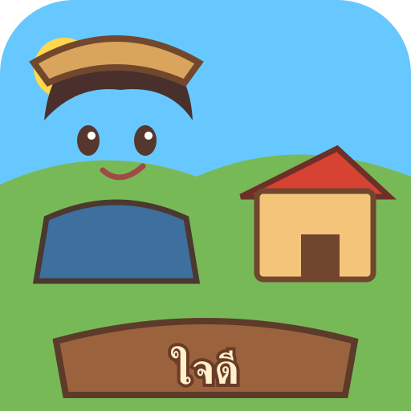

# 🌿 บ้านสวนสุขใจ — Baan Suan Sukjai

<p align="center">
  
</p>

<h2 align="center">🏡 บ้านสวนสุขใจ</h2>

<p align="center">
  <strong>โลกเกมเล็ก ๆ ที่ออกแบบมาให้เดินทาง สำรวจ ใช้ชีวิต และสนุกบนมือถือ</strong><br>
  <sub>Mobile-first • Pixel-style • Touch control • Web Game</sub>
</p>

<p align="center">
  <a href="https://minecraft-web.buss2545.workers.dev">
    🎮 เล่นเกมออนไลน์
  </a>
  &nbsp;&nbsp;•&nbsp;&nbsp;
  <a href="https://buss2545.github.io/minecraft-web/">
    🌐 เปิดหน้าเว็บโปรเจกต์
  </a>
</p>

---

## ✨ เกี่ยวกับโปรเจกต์

**บ้านสวนสุขใจ (Baan Suan Sukjai)** คือเกมเว็บแนวโลกจำลอง/ผจญภัยที่สร้างด้วย **HTML, CSS และ JavaScript** โดยให้ความสำคัญกับการเล่นบนโทรศัพท์เป็นหลัก แต่ยังรองรับหน้าจอคอมพิวเตอร์ด้วย

หัวใจของเกมอยู่ที่ไฟล์:

> **`public/baan-suan-sukjai-core.html`**

ไฟล์นี้คือ **Game Core** ที่รวมส่วนสำคัญของตัวเกมไว้ในหน้าเดียว เพื่อให้เปิดเล่นได้ง่ายและลดความยุ่งยากในการติดตั้ง

📌 **รุ่นที่ใช้ใน README นี้:** `baan-suan-sukjai-core.html` รุ่นล่าสุดที่ผู้พัฒนาปรับปรุงไว้ประมาณ **2 ชั่วโมงก่อน**

---

# 🎮 GAME CORE

## 🏡 บ้านสวนสุขใจคืออะไร?

นี่ไม่ใช่แค่หน้าเว็บธรรมดา แต่เป็นพื้นที่สำหรับสร้างประสบการณ์เกมแบบเต็มหน้าจอ โดยออกแบบให้ผู้เล่นสามารถควบคุมตัวละครและใช้งานระบบต่าง ๆ ผ่านหน้าจอสัมผัสได้โดยตรง

### จุดเด่น

- 📱 **Mobile-first** — ออกแบบโดยคิดจากการเล่นบนมือถือก่อน
- 🖥️ **รองรับคอมพิวเตอร์** — ปรับการแสดงผลให้ใช้งานบนจอขนาดใหญ่ได้
- 🎮 **Touch Control** — มีจอยเสมือนสำหรับการควบคุม
- 🕹️ **Action Button** — ปุ่มแอ็กชันขนาดใหญ่ กดง่ายบนหน้าจอ
- ⚡ **Fullscreen Game UI** — ใช้พื้นที่หน้าจอให้คุ้มที่สุด
- 🧩 **ระบบหน้าต่างภายในเกม** — เมนูและแผงข้อมูลเปิดใช้งานจากตัวเกมโดยตรง
- 🗺️ **ระบบแสดงผลโลกเกม** — ใช้ Canvas และภาพแบบ pixelated
- 💾 **โครงสร้างพร้อมต่อยอด** — สามารถเพิ่มระบบและเนื้อหาใหม่ได้ในอนาคต

---

# 🕹️ ระบบควบคุม

ตัวเกมถูกออกแบบมาเพื่อให้เล่นด้วยนิ้วบนมือถือได้ง่าย

### 🎮 การเคลื่อนที่

ใช้ **Virtual Joystick** บริเวณด้านล่างของหน้าจอเพื่อควบคุมตัวละคร

### 🟡 ปุ่ม Action

ปุ่มแอ็กชันขนาดใหญ่สำหรับการโต้ตอบกับโลกและระบบต่าง ๆ

### 🏃 โหมดการเคลื่อนที่

ตัวเกมมีรูปแบบการควบคุมที่ปรับเปลี่ยนได้ตามโหมดการเล่น รวมถึงปุ่มสำหรับการวิ่งในโหมดที่รองรับ

### 🧰 แถบเครื่องมือ

บริเวณด้านล่างของหน้าจอมีแถบเครื่องมือสำหรับเข้าถึงสิ่งของ/เครื่องมือที่ใช้ในเกมอย่างรวดเร็ว

---

# ❤️ HUD & สถานะตัวละคร

หน้าจอเกมมี HUD ขนาดกะทัดรัดสำหรับแสดงข้อมูลสำคัญ โดยออกแบบให้ไม่บังพื้นที่เล่นมากเกินไป

ตัวเกมมีองค์ประกอบ เช่น

- ❤️ พลังชีวิต
- ⚡ ค่าพลัง/สถานะ
- 📊 แถบสถานะ
- 🔔 ข้อความแจ้งเตือน
- 🧭 ข้อมูลระหว่างเล่น
- 🪙 ข้อมูลและค่าต่าง ๆ ของตัวละคร

ข้อความแจ้งเตือนจะแสดงเป็น **Toast** บริเวณกลางหน้าจอเมื่อเกิดเหตุการณ์สำคัญ

---

# 📖 เมนูและหน้าต่างระบบ

ระบบ UI ของเกมถูกออกแบบเป็นหน้าต่างแบบ Game Sheet เพื่อให้ใช้งานบนมือถือได้สะดวก

มีโครงสร้างสำหรับระบบต่าง ๆ เช่น

- 👤 ข้อมูลตัวละคร
- 🎒 ช่องเก็บของ / ไอเทม
- 🧰 เครื่องมือ
- 📜 ภารกิจ
- 🗺️ แผนที่
- ⚙️ การตั้งค่า
- 🎨 การปรับแต่งบางส่วนของ UI
- 💬 กล่องสนทนา/ข้อความ
- 📋 รายการและข้อมูลภายในเกม

หน้าต่างต่าง ๆ ถูกออกแบบให้เลื่อนภายในตัวเองได้ เพื่อไม่ให้การเล่นหลักเสียพื้นที่โดยไม่จำเป็น

---

# 🗺️ โลกของเกม

Game Core ใช้ **HTML Canvas** เป็นพื้นที่หลักในการแสดงโลกเกม

การเรนเดอร์ถูกตั้งค่าให้เหมาะกับภาพแนว pixel-art โดยใช้:

- Canvas เต็มหน้าจอ
- Pixelated rendering
- UI แบบ layered
- ระบบ modal / sheet
- เอฟเฟกต์ fade
- HUD แบบลอยเหนือโลกเกม

ทำให้สามารถต่อยอดไปสู่โลกที่มีพื้นที่และระบบจำนวนมากได้

---

# 🌾 แนวทางของเกม

**บ้านสวนสุขใจ** ตั้งใจให้เป็นโลกเกมที่สามารถค่อย ๆ เพิ่มรายละเอียดได้เรื่อย ๆ

แนวคิดหลักคือ:

> **เดินเล่น → สำรวจ → พบสิ่งใหม่ → ทำภารกิจ → เก็บของ → พัฒนาตัวละคร → กลับมาสำรวจอีกครั้ง**

ตัวเกมจึงไม่ได้ถูกออกแบบมาให้มีเพียงฉากเดียว แต่โครงสร้างถูกเตรียมไว้สำหรับการเพิ่มระบบและเนื้อหาในอนาคต

---

# 🌐 Web Game

เกมสามารถเปิดจากเว็บได้โดยตรง ไม่จำเป็นต้องติดตั้งโปรแกรมเพิ่มเติม

### 🎮 วิธีเล่น — 2 ทาง

#### 1. 🌐 เล่นเกมออนไลน์

**ตัวเกมที่ใช้งานจริง**

https://minecraft-web.buss2545.workers.dev

ลิงก์นี้ใช้สำหรับ **เข้าเล่นเกมโดยตรง** ผ่านระบบ Worker ของโปรเจกต์

#### 2. 📂 เปิดหน้าเว็บโปรเจกต์

**GitHub Pages**

https://buss2545.github.io/minecraft-web/

หน้านี้ใช้สำหรับ **หน้าเว็บ/ไฟล์โปรเจกต์** และเป็นอีกช่องทางในการเข้าถึงโปรเจกต์ ไม่ใช่ลิงก์หลักสำหรับการเล่นเกมออนไลน์

> ⭐ ถ้าต้องการเล่นเกม ให้เลือก **🎮 เล่นเกมออนไลน์** เป็นหลัก

---

# 🧱 โครงสร้างโปรเจกต์

```text
minecraft-web/
│
├── public/
│   ├── index.html
│   ├── game.js
│   ├── game.css
│   ├── manifest.webmanifest
│   ├── sw.js
│   │
│   ├── baan-suan-sukjai-core.html
│   │
│   ├── game-core/
│   │   └── baan-suan-sukjai-core.html
│   │
│   └── icons/
│       ├── icon-192.svg
│       └── icon-512.svg
│
├── src/
│   ├── index.js
│   └── room.js
│
├── wrangler.jsonc
└── .github/
    └── workflows/
```

---

# ⚙️ เทคโนโลยี

โปรเจกต์นี้ใช้เทคโนโลยีเว็บเป็นหลัก

| เทคโนโลยี | หน้าที่ |
|---|---|
| HTML5 | โครงสร้างเกมและ UI |
| CSS3 | การออกแบบหน้าจอและ Responsive UI |
| JavaScript | ระบบเกมและการโต้ตอบ |
| Canvas | การแสดงผลโลกเกม |
| WebSocket | การสื่อสารแบบเรียลไทม์ในส่วนที่รองรับ |
| Cloudflare | โครงสร้างฝั่งเซิร์ฟเวอร์/การ Deploy |
| GitHub Pages | การเผยแพร่หน้าเว็บ |

---

# 📱 Mobile First

สิ่งที่ให้ความสำคัญเป็นพิเศษคือ **มือถือ**

UI ถูกออกแบบโดยคำนึงถึง:

- 👆 การกดด้วยนิ้ว
- 📐 หน้าจอแนวตั้ง
- 🔒 Safe Area ของมือถือ
- 🖥️ การปรับตามขนาดหน้าจอ
- 🕹️ ปุ่มขนาดใหญ่
- 🎮 จอยเสมือน
- 📜 การเลื่อนเฉพาะพื้นที่
- 🚫 ป้องกันการกด/เลือกข้อความโดยไม่ตั้งใจระหว่างเล่น

---

# 🎨 งานออกแบบ

ธีมของเกมผสมระหว่าง

**🌿 บ้านสวน + 🏡 ชีวิตชนบท + 🎮 Pixel Game + 🌙 Fantasy UI**

โทน UI ใช้สีธรรมชาติ เช่น น้ำตาล ทอง เขียว และน้ำเงินเข้ม พร้อมกรอบและปุ่มที่ให้ความรู้สึกเหมือนหน้าต่างเกม RPG

ฟอนต์หลักของ UI รองรับภาษาไทยและออกแบบให้เหมาะกับการอ่านบนหน้าจอขนาดเล็ก

---

# 🔥 Game Core ที่กำลังพัฒนา

`baan-suan-sukjai-core.html` ถูกวางให้เป็นแกนกลางของเกม และสามารถพัฒนาต่อได้อีกมาก เช่น

- 🌍 เพิ่มพื้นที่โลก
- 🧑‍🌾 เพิ่มตัวละคร
- 🧙 เพิ่ม NPC
- 📜 เพิ่มภารกิจ
- 🎒 เพิ่มไอเทม
- 🛠️ เพิ่มระบบเครื่องมือ
- 🏠 เพิ่มระบบบ้าน
- 🌾 เพิ่มระบบการใช้ชีวิต
- 🗺️ เพิ่มพื้นที่สำรวจ
- 💬 เพิ่มบทสนทนา
- 🌐 เพิ่มระบบ Multiplayer
- ⚔️ เพิ่มระบบการต่อสู้
- ✨ เพิ่มเอฟเฟกต์และกิจกรรมภายในโลก

---


---

# 🌾 สิ่งที่มีอยู่จริงใน Game Core

ข้อมูลส่วนนี้สรุปจากโค้ดภายใน `public/baan-suan-sukjai-core.html` โดยตรง

## 👤 สร้างตัวละครก่อนเริ่มเกม

หน้าเริ่มเกมให้ผู้เล่นกำหนดตัวละครได้หลายส่วน เช่น ชื่อตัวละคร ชื่อไร่ วันเกิด นิสัย เพศ ทรงผม สีผม สีเสื้อ สีผิว หมวก ชุดเริ่มต้น และสัตว์เลี้ยง (สุนัขหรือแมว) รวมถึงอัปโหลดภาพตัวละครของตัวเองได้ และมีปุ่ม 🎲 สำหรับสุ่มชื่อตัวละครกับชื่อไร่

## 🌱 ระบบชีวิตในบ้านสวน

Game Core มีโครงสร้างระบบสำหรับ

- 🌾 ทำไร่และปลูกพืช
- 🐕 / 🐈 สัตว์เลี้ยง
- 🎣 ตกปลาและมินิเกมตกปลา
- ⛏️ ลงเหมืองและเก็บทรัพยากร
- 🎒 ไอเทมและช่องเก็บของ
- 🛠️ เครื่องมือและแถบเครื่องมือ
- 💰 เงินและทรัพยากร
- ❤️ พลังชีวิตและสถานะ
- 📜 ภารกิจและความคืบหน้า
- 🗺️ แผนที่และมินิแมป

## 🧑‍🤝‍🧑 NPC และความสัมพันธ์

ภายใน Game Core มีระบบตัวละครหมู่บ้านและบทสนทนา พร้อมโครงสร้างสำหรับค่ามิตรภาพ ความสัมพันธ์ เหตุการณ์ และฉากเนื้อเรื่อง

- 💬 บทสนทนา
- 🤝 ค่ามิตรภาพ
- ❤️ ความสัมพันธ์
- 🎭 เหตุการณ์เนื้อเรื่อง
- 🎬 Cutscene / Cinematic
- 🎁 รางวัลและผลจากเหตุการณ์

## 🎣 มินิเกมตกปลา

ระบบตกปลามี UI มินิเกมเฉพาะ เช่น ตำแหน่งปลา โซนเป้าหมาย แถบความคืบหน้า และสถานะสำเร็จ/ไม่สำเร็จ

## 💾 ระบบบันทึกเกม

หน้าเริ่มเกมมี

- ▶️ เริ่มเกมใหม่
- 💾 เล่นต่อจากที่บันทึก
- ⬆️ นำเข้าไฟล์เซฟ

ตัวเกมยังมีการบันทึกสถานะในจังหวะสำคัญและก่อนออกจากหน้า

## 🎮 การควบคุมหลายรูปแบบ

### 🕹️ โหมดจอย
ใช้ Virtual Joystick ควบคุมตัวละคร

### 👆 โหมดแตะ
แตะพื้นเพื่อเดิน แตะคนหรือสิ่งของเพื่อโต้ตอบ และมีปุ่มสลับเดิน/วิ่ง

### 🖥️ คีย์บอร์ด

| ปุ่ม | การใช้งาน |
|---|---|
| WASD / ลูกศร | เดิน |
| Space / E / Enter | ทำ / คุย / ใช้เครื่องมือ |
| 1–9 | เลือกเครื่องมือ |
| Tab | เปลี่ยนเครื่องมือ |
| I | กระเป๋า |
| Q | ภารกิจ |
| M | แผนที่ |
| P | โทรศัพท์ |
| F | เต็มจอ |
| H / F1 | ช่วยเหลือ |
| Esc | เมนู / ปิดหน้าต่าง |

## 📱 โทรศัพท์และเมนูภายในเกม

UI ภายในเกมถูกทำเป็น Card/Sheet ที่เลื่อนข้อมูลภายในได้ และมีโครงสร้างสำหรับกระเป๋า ภารกิจ แผนที่ โทรศัพท์ ตัวละคร เครื่องมือ ค่าสถานะ การตั้งค่า และบทสนทนา

## 🎨 ธีมและ Layout Editor

Game Core มีระบบธีม Light/Dark และมี Layout Editor สำหรับจัดตำแหน่งองค์ประกอบ UI บนอุปกรณ์ต่าง ๆ

## ⚡ โหมดประหยัดพลังงาน

มีโหมด Lite สำหรับลดภาระของ UI โดยปิดแอนิเมชัน การเปลี่ยนผ่าน เบลอ และเงาตัวอักษรบางส่วน เพื่อช่วยอุปกรณ์สเปคต่ำ

## 🖥️ Canvas / Pixel Rendering / Cinematic

โลกเกมใช้ Canvas เต็มหน้าจอ พร้อม pixelated rendering และ image smoothing ที่ปิดไว้เพื่อให้ภาพคมขึ้น นอกจากนี้ยังมี Minimap, Fade transition, กล่องบทสนทนา, ภาพตัวละคร และฉาก Cinematic

---

# 🔎 สรุป Game Core

`baan-suan-sukjai-core.html` เป็นมากกว่าหน้าเว็บธรรมดา เพราะภายในมีทั้ง **หน้าสร้างตัวละคร, โลกเกม, ระบบควบคุม, HUD, เครื่องมือ, ไอเทม, ภารกิจ, แผนที่, มินิเกมตกปลา, NPC, บทสนทนา, ความสัมพันธ์, Cutscene, ระบบเซฟ, การนำเข้าเซฟ, ธีม, Layout Editor และการควบคุมสำหรับ PC**

ไฟล์นี้จึงเป็นแกนหลักของประสบการณ์เกม **บ้านสวนสุขใจ (Baan Suan Sukjai)**

---


---

# 📖 เนื้อเรื่องหลักของบ้านสวนสุขใจ

เรื่องราวเริ่มต้นเมื่อ **{p}** เดินทางออกจากเมืองใหญ่ด้วยรถสองแถวคันสุดท้ายของวัน เพื่อย้ายมาเริ่มต้นชีวิตใหม่ที่ **หมู่บ้านสุขใจ**

ที่นี่มีบ้านไม้เก่า ๆ กับไร่ผืนเล็กซึ่งเป็นมรดกจากญาติห่าง ๆ และผู้ใหญ่บ้าน **ลุงชัย** เป็นคนแรกที่มาต้อนรับ

จากคนที่เพิ่งย้ายเข้ามา ผู้เล่นจะค่อย ๆ เรียนรู้ชีวิตของหมู่บ้าน ตั้งแต่การปลูกผัก เก็บผลผลิต ขายของ ตกปลา ลงเหมือง ทำความรู้จักชาวบ้าน เข้าร่วมเทศกาล ไปจนถึงสร้างความสัมพันธ์กับคนในหมู่บ้าน

แนวคิดของเรื่องคือ **การเริ่มต้นชีวิตใหม่และค่อย ๆ กลายเป็นส่วนหนึ่งของชุมชน**

## 🌾 เส้นเรื่องหลัก 10 ภารกิจใน Game Core ปัจจุบัน

> **หมายเหตุ:** จากโค้ด `baan-suan-sukjai-core.html` รุ่นปัจจุบัน ระบบ `MAINQ` มี **10 ภารกิจหลัก** (ลำดับ 1–10) ไม่ใช่ 40 ภารกิจ ส่วนภารกิจรองและภารกิจประจำวันเป็นระบบแยกต่างหาก

| # | ภารกิจ | เนื้อเรื่อง / สิ่งที่ต้องทำ |
|---|---|---|
| 1 | ⭐ ทักทายผู้ใหญ่ชัย | พบ **ลุงชัย** ที่ลานกลางหมู่บ้าน เพื่อเริ่มทำความรู้จักหมู่บ้านและรับคำแนะนำในการเริ่มต้นชีวิตใหม่ |
| 2 | 🌱 เริ่มต้นเป็นชาวไร่ | ขุดดินและปลูกพืชให้ครบ 5 ต้น เริ่มต้นชีวิตเกษตรกรของตัวละคร |
| 3 | 🌾 ผลผลิตแรก | เก็บเกี่ยวผลผลิต 5 ชิ้น เพื่อเรียนรู้การดูแลและเก็บเกี่ยวจากไร่ของตัวเอง |
| 4 | 📦 ส่งของขึ้นลัง | ส่งของลงลังขายข้างบ้าน 8 ชิ้น เริ่มสร้างรายได้จากผลผลิต |
| 5 | 🤝 เพื่อนบ้านใหม่ | ทักทายชาวบ้าน 5 คน เพื่อเปิดโลกความสัมพันธ์และทำความรู้จักชุมชน |
| 6 | 🎣 หัดตกปลา | ตกปลาให้ได้ 3 ตัวจากทะเลสาบ บ่อ หรือทะเล เรียนรู้กิจกรรมสำคัญของหมู่บ้าน |
| 7 | ⛏️ ลงเหมือง | เดินทางไปภูเขาตะวันออกและลงเหมืองให้ถึงชั้น 5 เพื่อเปิดด้านการสำรวจและทรัพยากร |
| 8 | 🪵 บูรณะศาลาประชาคม | นำไม้ 40 และหิน 30 ไปบริจาคที่กระดานข่าวกลางหมู่บ้าน เพื่อช่วยฟื้นฟูพื้นที่ส่วนกลาง |
| 9 | 🎉 ร่วมงานเทศกาล | เข้าร่วมเทศกาลอย่างน้อยหนึ่งครั้ง เช่น สงกรานต์ บุญบั้งไฟ งานบุญข้าวใหม่ ลอยกระทง หรือวันหิมะตก |
| 10 | ❤️ หัวใจของหมู่บ้าน | สร้างความสนิทสนมกับใครสักคนให้ถึง 8 ดวงใจ เป็นจุดที่เรื่องราวเริ่มเปลี่ยนจาก “คนมาใหม่” เป็น “คนของหมู่บ้าน” |

### 🌅 หลังจบภารกิจหลัก

เมื่อภารกิจหลักทั้งหมดเสร็จ ระบบจะแจ้งว่า **“จบภารกิจหลักทั้งหมดแล้ว! หมู่บ้านสุขใจอยู่ดีมีสุข”**

แต่เกมยังเล่นต่อได้ เพราะยังมีระบบความสัมพันธ์ ภารกิจรอง ภารกิจรายวัน เทศกาล งานพาร์ทไทม์ การทำฟาร์ม การตกปลา เหมือง การทำอาหาร การคราฟต์ และกิจกรรมในหมู่บ้าน

---

# 🧑‍🤝‍🧑 ตัวละครทั้งหมดในหมู่บ้าน

## 💗 ตัวละครความสัมพันธ์

ตัวละครกลุ่มนี้มีระบบความสัมพันธ์แบบหลายระดับ สามารถเพิ่มมิตรภาพด้วยการพูดคุยและให้ของที่ชอบ และบางตัวละครสามารถพัฒนาไปถึงความสัมพันธ์เชิงโรแมนติกได้

### 🎨 น้ำฝน — นักวาดภาพ
หญิงสาวนักวาดภาพประจำหมู่บ้าน ชอบวาดทิวทัศน์และไร่ของผู้เล่น เมื่อสนิทมากขึ้น เธอเริ่มวาดภาพผู้เล่นไว้เป็นการส่วนตัว และเรื่องราวความรู้สึกของเธอจะชัดเจนขึ้น

**หัวใจเด่น:** ความรักผ่านภาพวาดและการมองเห็นอนาคตของคนสองคน

### 🩺 ใบเตย — หมอประจำหมู่บ้าน
หมอที่คอยดูแลสุขภาพของคนในชุมชน เป็นคนจริงจังกับงานแต่ก็มีมุมซุ่มซ่ามและอบอุ่น เมื่อสนิทกับผู้เล่น เธอเริ่มรู้สึกว่าหัวใจตัวเองเต้นผิดจังหวะทุกครั้งที่เจอผู้เล่น

**หัวใจเด่น:** จากการดูแลสุขภาพ สู่การค้นพบว่า “อาการใจเต้น” รักษาไม่ได้ด้วยยา

### 🌸 มะลิ — เจ้าของสวนดอกไม้
หญิงสาวผู้ดูแลสวนดอกไม้และร้อยพวงมาลัย เธอมองว่าดอกไม้ทุกดอกมีเรื่องราว และค่อย ๆ ใช้ดอกไม้สื่อความรู้สึกของตัวเอง

**หัวใจเด่น:** พวงมาลัยดอกมะลิที่ทำขึ้นเพื่อคนที่เธอรัก

### 🪚 ข้าวหอม — ช่างไม้
ช่างไม้ประจำหมู่บ้าน พูดตรง ๆ และไม่ถนัดเรื่องการแสดงความรู้สึก แต่แสดงความรักผ่านสิ่งที่ตัวเองสร้างขึ้น

**หัวใจเด่น:** กล่องไม้แกะสลักที่ใช้แทนคำพูดที่เธอไม่เก่งจะพูดออกมา

### 🎵 ภูมิ — ชาวประมงนักดนตรี
ชาวประมงที่ตกปลาในตอนเช้าและเล่นซออู้ในตอนเย็น เขาแต่งเพลงจากสิ่งที่พบในหมู่บ้าน และในช่วงความสัมพันธ์สูง เพลงของเขากลายเป็นเพลงที่เกี่ยวกับผู้เล่น

**หัวใจเด่น:** เพลง “บ้านของเรา” และคำถามว่าเขาจะได้เล่นเพลงให้ผู้เล่นฟังตลอดไปหรือไม่

### 🚤 กล้า — ช่างต่อเรือ
ช่างต่อเรือหางยาวผู้พูดน้อยและทำงานจริงจัง เขาสร้างเรือลำหนึ่งขึ้นมาโดยยังไม่รู้ว่าจะมอบให้ใคร ก่อนจะชวนผู้เล่นออกไปล่องเรือด้วยกัน

**หัวใจเด่น:** เรือที่สร้างไว้สำหรับ “สองคน”

### 📚 ธีร์ — บรรณารักษ์
ชายหนุ่มผู้ดูแลห้องสมุดวัด ชอบหนังสือเก่าและเป็นคนเงียบ ๆ เมื่อสนิทกับผู้เล่น เขาเริ่มเขียนเรื่องราวเกี่ยวกับผู้เล่นลงในสมุดของตัวเอง

**หัวใจเด่น:** เรื่องราวของผู้เล่นที่ค่อย ๆ กลายเป็นหน้าสำคัญที่สุดในสมุดของเขา

### 🎮 ต้นกล้า — นักเล่นเกมขี้เซา
หนุ่มสายเกมที่มีตารางชีวิตสบาย ๆ และมีมุมขี้เซา เป็นหนึ่งในคนรุ่นใหม่ของหมู่บ้าน

**หัวใจเด่น:** ความสัมพันธ์ที่เริ่มจากความสบาย ๆ และกิจวัตรประจำวัน

### 🌳 ลุงชัย — ผู้ใหญ่บ้าน
ผู้ใหญ่บ้านและคนสำคัญที่ต้อนรับผู้เล่นตั้งแต่วันแรก เป็นตัวละครที่เชื่อมผู้เล่นเข้ากับชุมชน และเป็นผู้ให้คำแนะนำสำคัญเกี่ยวกับการใช้ชีวิตในหมู่บ้าน

**หัวใจเด่น:** จาก “คนมาใหม่” สู่ “สมาชิกของหมู่บ้าน”

---

# 🏫 ตัวละครชุมชนและผู้คนรอบหมู่บ้าน

### 👩‍🏫 ครูพิมพ์ — ครูประจำโรงเรียนบ้านสวน
ครูผู้ดูแลโรงเรียนเล็ก ๆ ที่มีนักเรียนเพียงไม่กี่คน เธอเคยอยากเป็นครูในเมือง แต่เลือกอยู่ที่นี่เพราะเด็ก ๆ ในหมู่บ้านต้องการครูมากกว่า

ผู้เล่นสามารถช่วยเล่าเรื่องการปลูกผักให้เด็ก ๆ ฟัง และครูพิมพ์ยังมีระบบช่วยฟื้นพลังงานด้วยชาร้อน

### 👦 น้องกล้วย — นักเรียน ป.3
ลูกชายของลุงชัย เป็นเด็กที่ตั้งใจเรียน ชอบเรื่องเกษตร และอยากโตขึ้นมาเป็นเกษตรกรเก่ง ๆ เหมือนผู้เล่น

เขาชอบเล่นที่ลานเมืองหลังเลิกเรียน และมีบทบาทเชื่อมโยงกับครอบครัวของลุงชัย

### 👧 น้องฟ้า — นักเรียน ป.4
ลูกสาวของป้าแดงร้านชำ ชอบวาดรูปและอยากเป็นจิตรกร เธอมองผู้เล่นเป็นแบบอย่าง และชอบวาดภาพทุ่งนาและชีวิตในหมู่บ้าน

### 🛒 ป้าแดง — เจ้าของร้านชำ
เจ้าของร้านชำประจำหมู่บ้าน แม่ของน้องฟ้า เป็นหนึ่งในคนสำคัญด้านการซื้อขายสินค้าและชีวิตประจำวัน

### 👗 ป้าลัดดา — ช่างตัดเสื้อผ้าไทย
เจ้าของร้านผ้าไทย ผู้ดูแลเสื้อผ้าและชุดต่าง ๆ ของผู้เล่น มีชุดไทยและชุดตามฤดูกาลให้เลือก

### 🧓 ปู่เทียน — ผู้เฒ่าผู้รักษาศาล
ผู้เฒ่าที่ดูแลศาลประจำหมู่บ้าน เป็นตัวละครที่เกี่ยวข้องกับการขอพรและเรื่องราวความเชื่อของชุมชน

---

# 🛕 ตัวละครวัดสุขใจ

### 🙏 หลวงพี่สุข
พระภิกษุประจำวัดสุขใจ เป็นตัวละครที่เน้นเรื่องความสงบ สติ และการใช้ชีวิตอย่างใจเย็น

มีกิจกรรมประจำวัน เช่น เดินบิณฑบาต กวาดลานวัด รดน้ำต้นไม้ และให้พรผู้เล่น

### 🙏 หลวงพี่ใจ
พระภิกษุอีกรูปของวัดสุขใจ มีบุคลิกอบอุ่นและพูดคุยเรื่องธรรมะในแบบเข้าใจง่าย

ทั้งหลวงพี่สุขและหลวงพี่ใจมีระบบกิจวัตรของพระและเหตุการณ์บิณฑบาต รวมถึงการให้พรประจำวัน

---

# 🏘️ ชีวิตประจำวันของตัวละคร

ตัวละครไม่ได้ยืนอยู่กับที่ตลอดเวลา แต่ Game Core มีตารางเวลาและสถานที่ของ NPC เช่น

- 🏠 กลับบ้าน
- 🏫 ไปโรงเรียน
- 🛍️ ไปตลาด
- 🌸 ไปสวนดอกไม้
- 🎣 ไปทะเลสาบ
- 🚤 ไปท่าเรือ
- 🛕 ไปวัด
- 🏙️ ไปเดินเล่นที่ลานเมือง
- 🙏 ออกบิณฑบาต
- 🥁 กิจกรรมวัดและวันพระ
- 🎉 เข้าร่วมเทศกาล

ทำให้หมู่บ้านมีความรู้สึกเหมือนเป็นชุมชนที่มีชีวิต ไม่ใช่เพียงตัวละครที่รอผู้เล่นอยู่จุดเดิม

---

# 💕 ระบบความสัมพันธ์

ความสัมพันธ์เป็นหนึ่งในแกนสำคัญของเนื้อเรื่อง

ผู้เล่นสามารถ

1. 💬 พูดคุยกับชาวบ้าน
2. 🎁 มอบของที่แต่ละคนชอบ
3. ❤️ เพิ่มระดับหัวใจ
4. 💗 พัฒนาความสัมพันธ์
5. 💍 ไปสู่การแต่งงานกับ NPC ที่รองรับ
6. 🏡 มีระบบชีวิตคู่และครอบครัวในส่วนที่เกมรองรับ

ตัวละครแต่ละคนมีของที่ **ชอบ / รัก / ไม่ชอบ** แตกต่างกัน ทำให้การสร้างความสัมพันธ์ต้องสังเกตตัวละคร ไม่ใช่ให้ของอะไรก็ได้

---

# 🎭 แก่นของเนื้อเรื่อง

**บ้านสวนสุขใจ** ไม่ได้เน้นเพียงการ “ชนะเกม”

แก่นของเรื่องคือการเดินทางของคนคนหนึ่งที่ย้ายออกจากเมืองใหญ่ แล้วค่อย ๆ สร้างชีวิตใหม่จากไร่ผืนเล็ก ๆ

จาก

> **คนแปลกหน้า → ชาวไร่ → เพื่อนบ้าน → เพื่อนสนิท → คนสำคัญของชุมชน**

และท้ายที่สุด ผู้เล่นไม่ได้เพียงสร้างบ้านหรือทำเงิน แต่กำลังสร้าง **“บ้าน” ที่มีผู้คน ความทรงจำ และความสัมพันธ์อยู่รอบตัว**

---

# 🛡️ เป้าหมายของโปรเจกต์

เป้าหมายไม่ได้มีแค่การทำให้เกม “เปิดได้”

แต่คือการสร้างเกมเว็บที่:

> **เปิดง่าย • เล่นง่าย • ใช้มือถือได้จริง • ขยายระบบได้ • และยังพัฒนาต่อได้ในระยะยาว**

---

# 🚀 สถานะโปรเจกต์

**บ้านสวนสุขใจ — กำลังพัฒนาอย่างต่อเนื่อง**

| ส่วน | สถานะ |
|---|---|
| 🌐 Web Game | ✅ ใช้งานได้ |
| 📱 Mobile UI | ✅ มีระบบรองรับ |
| 🎮 Touch Control | ✅ มี |
| 🖥️ Desktop | ✅ รองรับ |
| 🧩 Game Core | 🔥 พัฒนาต่อเนื่อง |
| 🗺️ World System | 🔥 พัฒนาต่อเนื่อง |
| 👤 Character System | 🔥 พัฒนาต่อเนื่อง |
| 📜 Quest / Content | 🔥 ขยายต่อได้ |
| 🌐 Multiplayer | 🔧 มีโครงสร้างรองรับ |
| 🎨 UI / UX | 🔥 ปรับปรุงต่อเนื่อง |

---

# ❤️ เครดิต

**Baan Suan Sukjai / บ้านสวนสุขใจ**

สร้างขึ้นด้วยความตั้งใจที่จะทำให้เกมเว็บภาษาไทยสามารถเล่นบนมือถือได้ง่าย และค่อย ๆ เติบโตเป็นโลกเกมของตัวเอง

<p align="center">
  <strong>🌿 ยินดีต้อนรับสู่บ้านสวนสุขใจ 🏡</strong><br>
  <sub>เปิดเกม • ออกเดินทาง • แล้วกลับมาพักที่บ้าน</sub>
</p>

---

<p align="center">
  
</p>
